My name is Philip Chase.
Today I'll be showing you how RED-I loads data into a REDCap project.  

I'll be using a copy of the HCV Target RedCap project for my demo today.  

I'll start with a completely empty Project

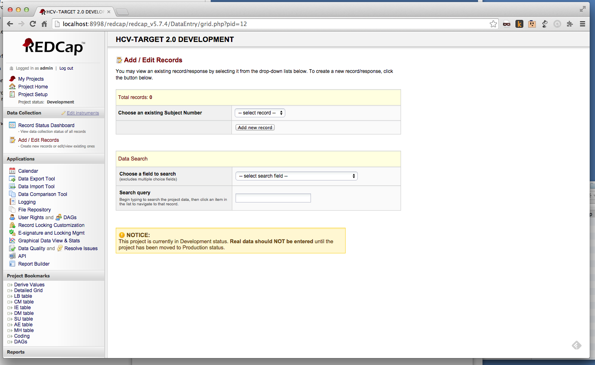

Note the record count of zero.

Now I'll load some data with RED-i

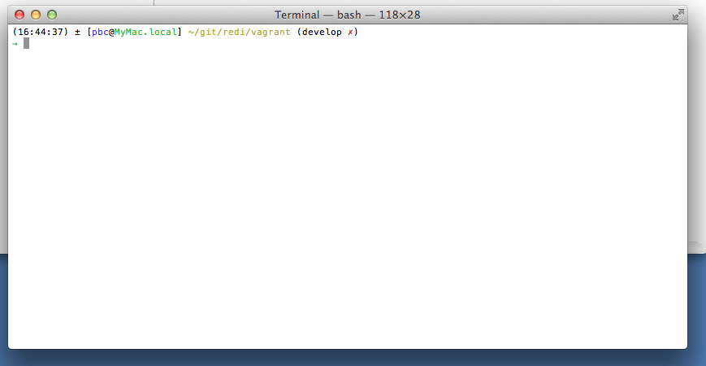

First I'll load 5 records of demographic data to.  RED-I will read these records to determine which REDCap records shoudl get the data for each study subject

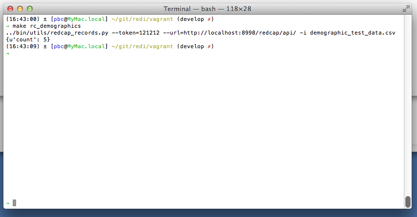

Then we'll start REDI.

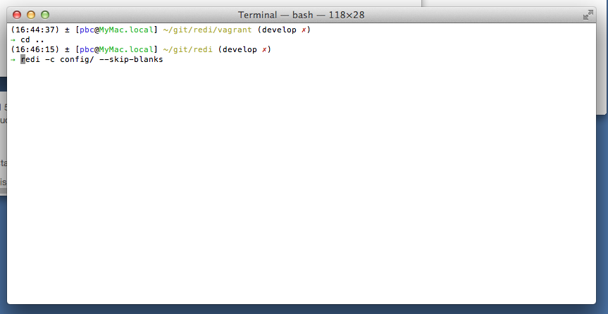

While REDI is running, we'll look at little bit at the problem it's solving.

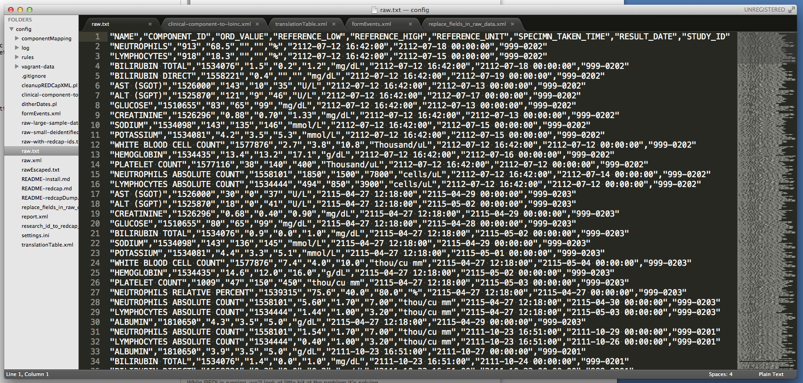

REDI is designed to read tabular data as input.  Comma separated variable files or CSV files are the lowest common denominator.  This is the file REDI is loading into REDCap.  

The problem is REDCap can't consume this.  This data has to be transformed multiple times before it can be loaded into REDCap.  

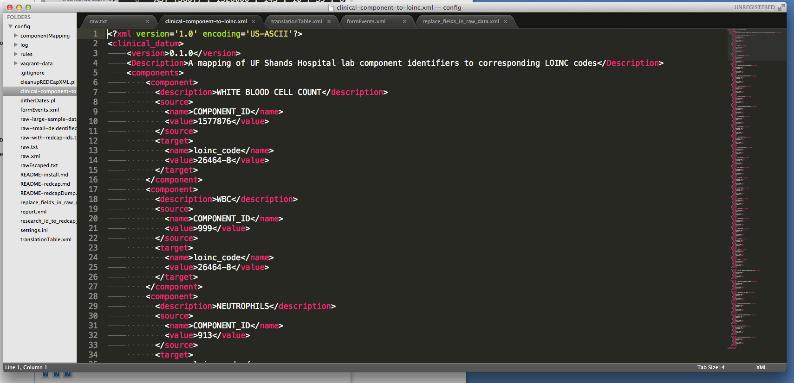

This first step is to LOINC IDs on each lab component.  We use this XML file as input to make that transformation.

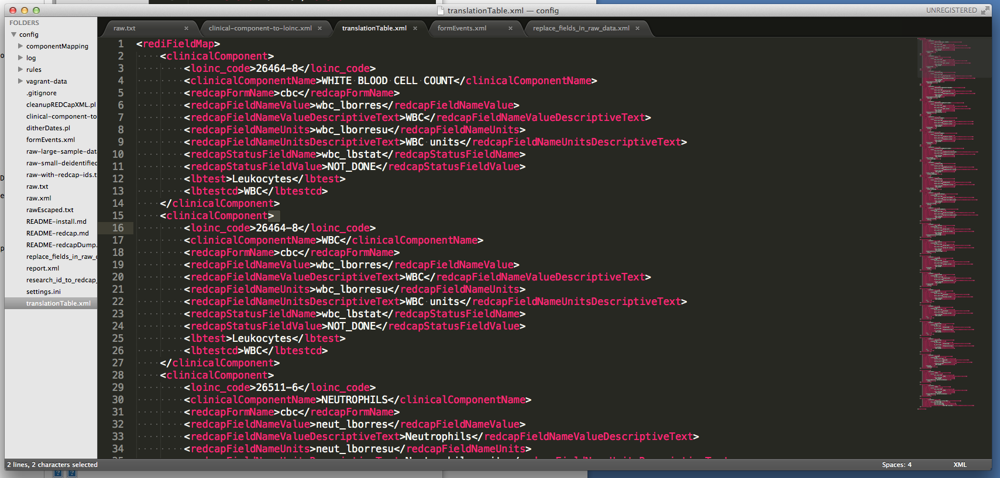

We then have to tell REDCap the form and field name for lab result, the field name for the units, and any field status data.  This file represents another data transformation.

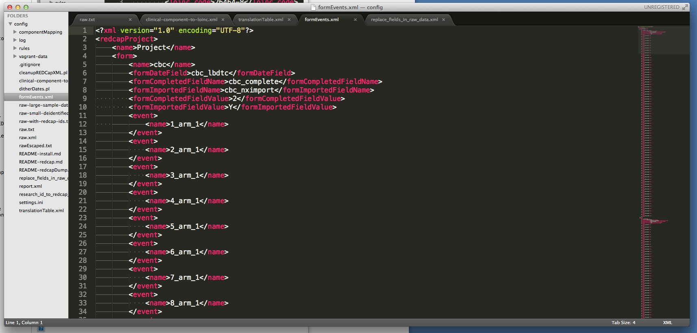

We also have to tell RED-I some details about the form where the data will be written.  It needs to know how many events there are to store the longitudinal data, as well as the names of status fields it might need to manipulate.  

Once RED-i has made these transformations, it conects to the REDCap server and loads the data.  When it finishes it sends a summary report to the study team.  

Here is the report for the import job we just ran.

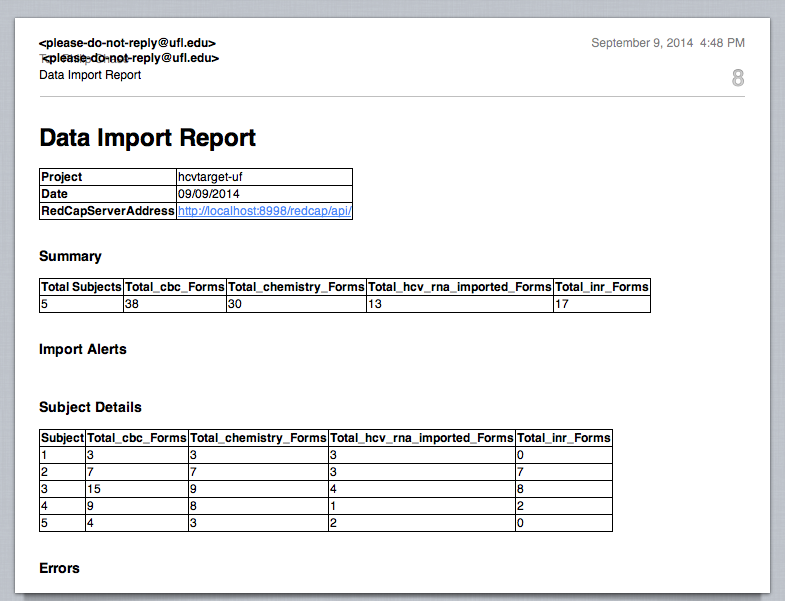

You can see summary data for the job as well as any alerts or errors that were encountered.  In the subject details section we can see subject ID 3 had a lot of data loaded.  

We'll take a look at that subject's data.

Returning to REDCap we can reload the page and see we now have 5 subjects in the system.  

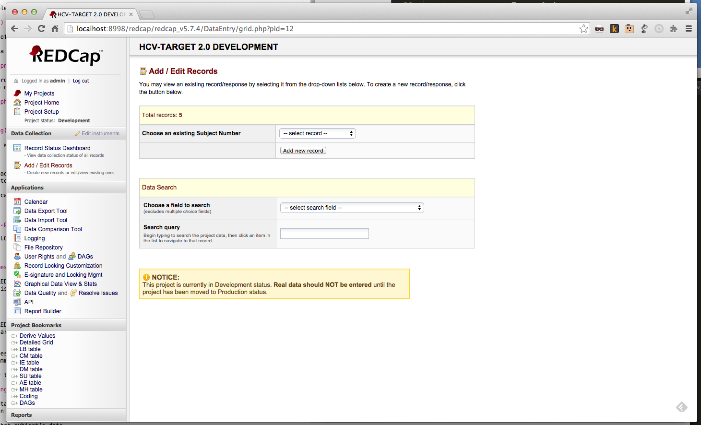

Select subject 3, we can see the forms that received data have been marked as complete and now show with green dots where the used to be red.

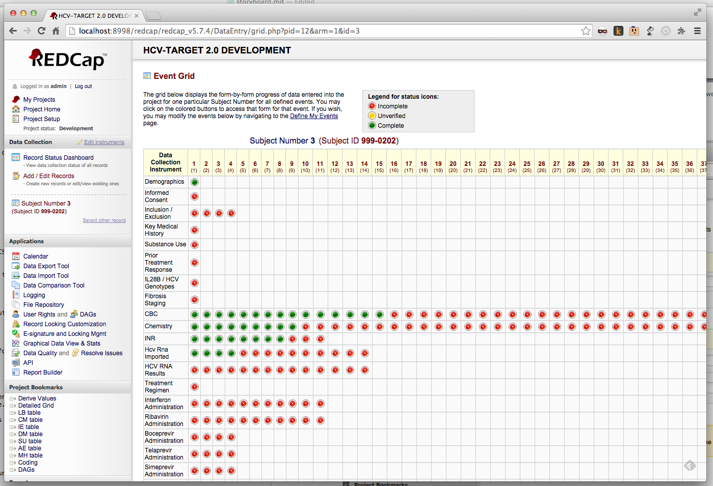

Let's open up a CBC form to see some imported data

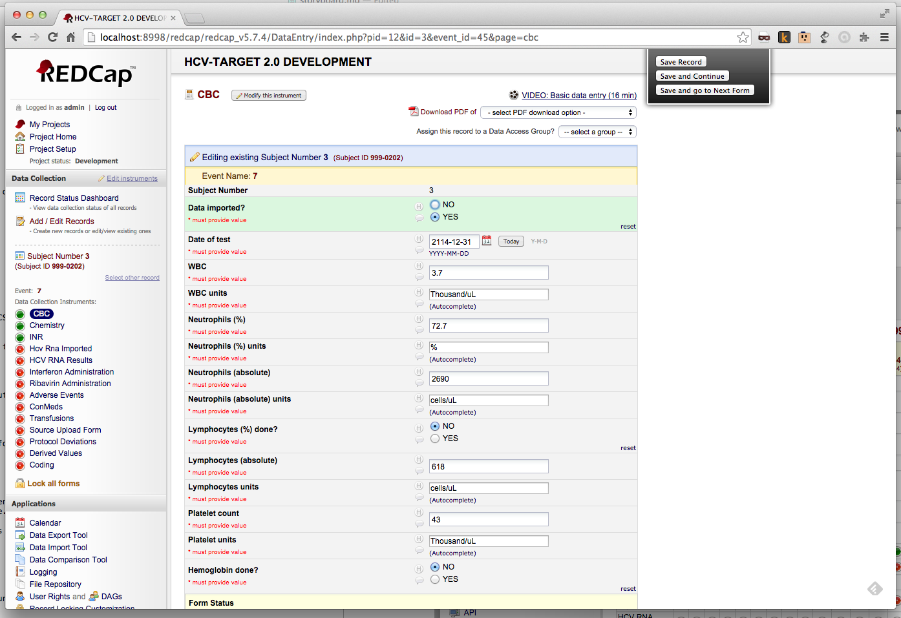

That's what REDI does.  If you'd like to try RED-i it's accessible on GitHub.  

RED-I is under active development.  We encourage you to try it out, provide feedback and help us make it even better.  

